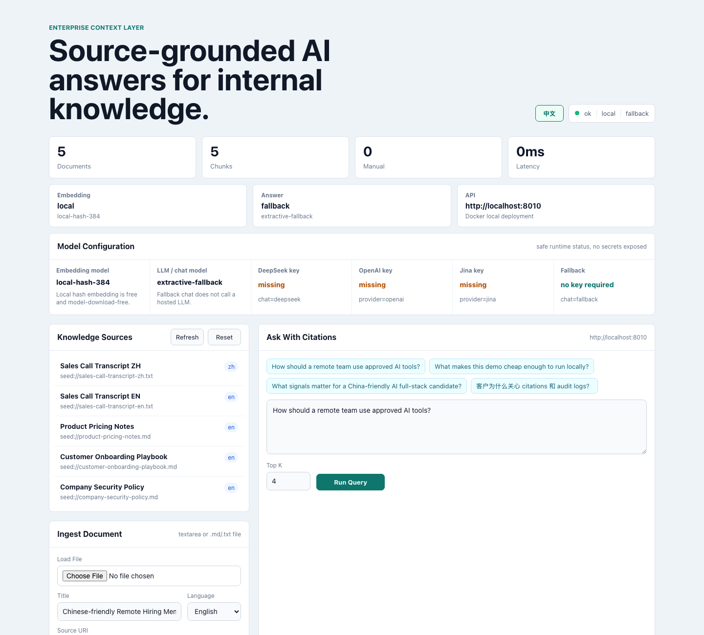
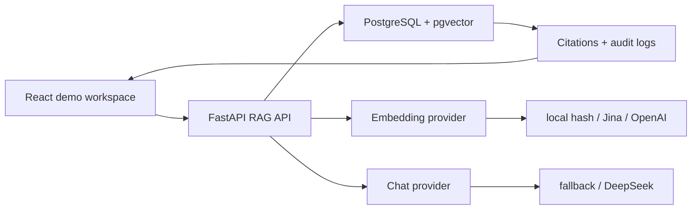

# Enterprise Context Web

Frontend demo for the Enterprise Context Layer backend.

It now includes the core demo loop: view seeded knowledge, load a `.md` or `.txt` file, ingest a manual document, ask cited questions, inspect retrieval debug details, review audit logs, delete manual documents, and reset demo data.



The UI defaults to English and includes a manual Chinese toggle. It does not auto-detect browser or system locale, which keeps recordings deterministic.

## Model Configuration

The default local demo is intentionally zero-key:

- Embedding: `local-hash-384`
- Chat / LLM: `extractive-fallback`
- Hosted LLM calls: disabled by default

To use a hosted LLM, configure the backend `.env` and restart the API:

```bash
CHAT_PROVIDER=deepseek
DEEPSEEK_API_KEY=your_key_here
DEEPSEEK_MODEL=deepseek-chat
```

To use stronger semantic embeddings:

```bash
EMBEDDING_PROVIDER=jina
JINA_API_KEY=your_key_here
JINA_EMBEDDING_MODEL=jina-embeddings-v3
```

After changing embedding providers, call `POST /demo/reset` or use the Reset button so documents are re-ingested with the active embedding model.

## Portfolio Signal

This project is intentionally shaped as an interview-friendly AI full-stack demo:

- Frontend owns the complete workflow instead of showing a bare chat box.
- Backend exposes source-grounded RAG APIs with citations and audit logs.
- Local deployment keeps the recording cheap and repeatable.
- Provider seams make it easy to swap local, Jina, OpenAI, and DeepSeek paths.

Backend repo:

- `/Users/chenwencheng/codebase/ai-app/enterprise-context-api`
- GitHub API repo: https://github.com/mowtwo/enterprise-context-api
- Local API: `http://localhost:8010`
- Frontend env: `VITE_API_BASE_URL=http://localhost:8010`

## Architecture



## Demo Checklist

- Load `docs/sample-remote-hiring-memo.md` or another `.md/.txt` memo into the ingest form.
- Ingest the document and confirm it appears under Knowledge Sources.
- Ask a question and inspect answer, citations, latency, cost, and Retrieval Debug.
- Review the Audit Trail.
- Delete manual documents or Reset to return to a clean recording state.
- Toggle Chinese and confirm the same workflow remains readable for China-friendly outreach.

## Run

```bash
cd /Users/chenwencheng/codebase/ai-app/enterprise-context-web
cp .env.example .env
npm install
npm run dev
```

Quality gate:

```bash
npm run check
```

Open the Vite URL and make sure the backend is running with:

```bash
cd /Users/chenwencheng/codebase/ai-app/enterprise-context-api
docker compose up -d
```

Docs:

- `docs/product.md`
- `docs/development.md`
- `docs/recording-script.md`
- `docs/testing-checklist.md`
